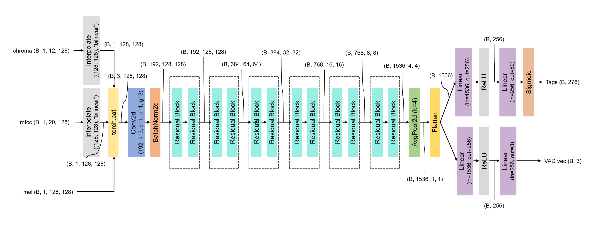
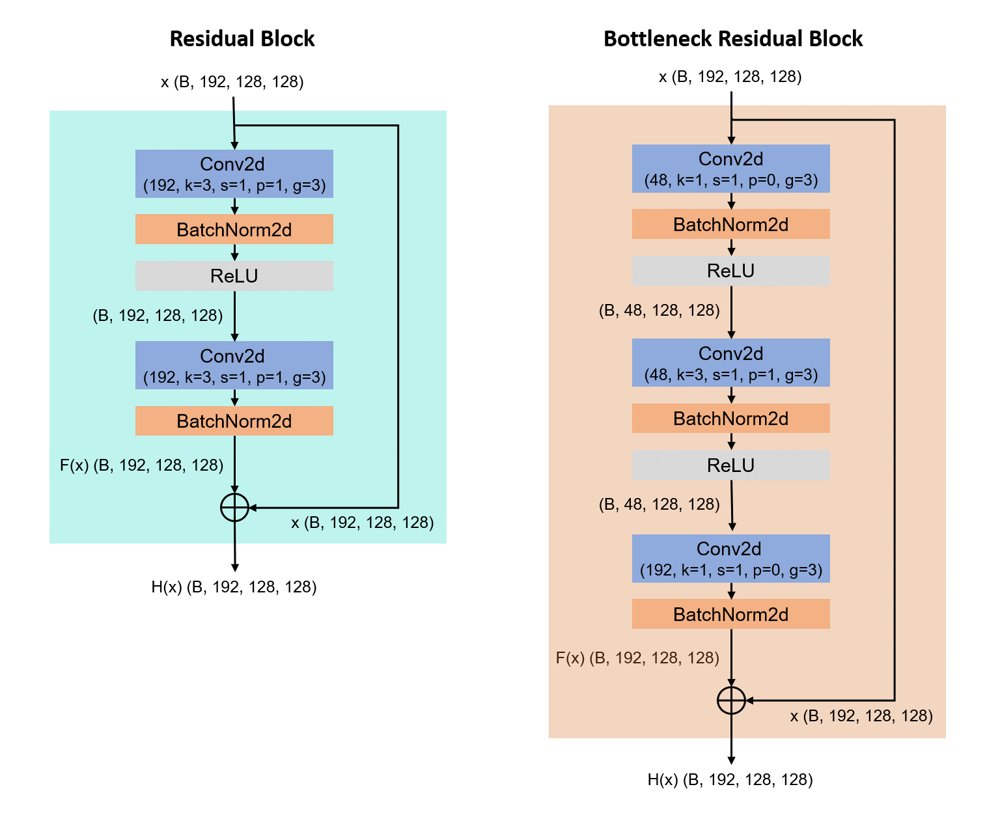
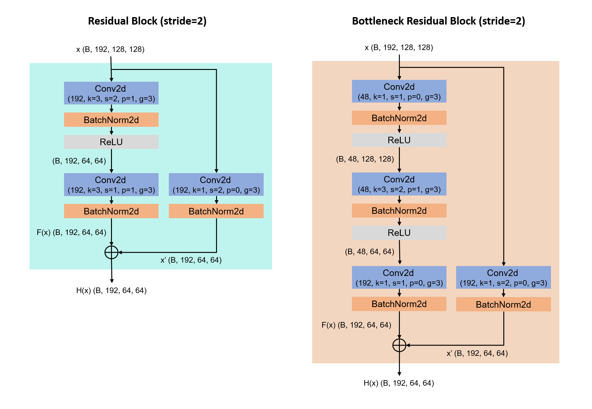

# music-sentiment-analysis

Music Sentiment Analyzer (MSA) predicts real-time sentiment of given music as VAD:
- **Valence**: the pleasantness of a stimulus
- **Arousal**: the intensity of emotion provoked by a stimulus
- **Dominance**: the degree of control exerted by a stimulus


## How to run

Codes of this repository were implemented on:
- windows 10
- python 3.11.5
- torch 2.1.0+cu118

First, install required packages with conda. 
```
conda env create -f environment.yaml
conda activate environment
```

You have to get [MuSe Dataset](https://www.kaggle.com/datasets/cakiki/muse-the-musical-sentiment-dataset) to generate your own dataset. 
You also have to log in Spotify API id and get CID and SECRET [here](https://developer.spotify.com).

Next, open [`user_values.py`](./user_values.py) and type path to your csv file, and Spotify API information. 
- `MUSE_CSV_PATH`: path to your MuSe csv file
- `SPOTIFY_CID`: Spotify API CID
- `SPOTIFY_SECRET`: Spotify API SECRET

Run [`generate_dataset.py`](./generate_dataset.py) to preprocess your own dataset. 
After running the command, you can see some npz files those compose a dataset. 
You can edit some parameters in editable zone if you can. 
```
python generate_dataset.py
```


## Dataset

The example data is shown in [Appendix A](#appendix-a-example-of-dataset). 

I used [MuSe Dataset](https://www.kaggle.com/datasets/cakiki/muse-the-musical-sentiment-dataset) that contains sentiment information for 90,001 songs. 

It contains Spotify ID of songs, whose audios are available by using [Spotipy API](https://spotipy.readthedocs.io/en/2.22.1/?highlight=analysis#). However, there are some rows with no spotify id or no preview mp3, 34,951 songs are actually used for this project. 

After pre-processing the dataset, input and output of my model are:
- **input**
    - Mel-spectrogram
        
    - Mel-Frequency Cepstral Coefficients (MFCCs)
        
    - Chroma Frequencies
        
- **output**
    - VAD vector as (B, 3) `torch.Tensor`
        - `[[2.09, 6.18, 1.4]]` means the audio has high **Arousal**, while it has low **Valence** and **Dominance**. 
    - list of emotion tags as (B, num_tags) `torch.Tensor`. Each tag output is activated with `Sigmoid()`, so we can decide whether it matches the given audio or not. 
        - `[[1., 0., 1., 0.]]` for emotion tag dictionary `["reckless", "innocent", "confident", "serious]` means the audio tends to be reckless and confident, and not innocent and serious. 

Because dataset preprocessing task requires a lot of time, I implemented [`generate_dataset.py`](./generate_dataset.py) to save chunk of the full dataset. 
After running the code, there would be some npz files instead of one huge npz file. 
The npz files are combined to a full dataset during training. 


## Model

The precise structure of my network is shown in [Appendix B](#appendix-b-structure-of-network). 

I refered to the structure of [ResNet](https://arxiv.org/abs/1512.03385), which is specialized to image classification task. 

I used residual blocks and bottleneck residual blocks. (refer to [`model.py`](./model.py))
CNN layers in the blocks are grouped so that features from Mel-Spectrogram don't interact with features from MFCCs during feature extraction. ([Concepts of group in CNN](https://pytorch.org/docs/stable/generated/torch.nn.Conv2d.html))
- If we use all of Mel-Spectrogram, MFCCs, and Chroma Frequencies, CNN layers are grouped by 3. 
- If we use two of them, CNN layers are grouped by 2. 
- If we use only one of them, CNN layers act like usual. 

Whole structure of the network is shown below (we use all inputs):



The residual block is one of basic residual block or bottleneck residual block. 

Basic residual block and bottleneck residual block are implemented as shown below. (`k`: kernel size, `s`: stride, `p`: padding, `g`: groups)
Bottleneck residual block reduces number of channels during 3x3 convolution, so it can reduce parameters of the block.



To reduce width and height of the feature, the first residual blocks of block-group (dashed-line border in the model figure) have stride = 2. 
Then, residual block should use short-cut convolution layers instead of identity function, because the output width and height reduces. 




## Appendix

### Appendix A: example of dataset

Example of dataset created by [`generate_dataset.py`](./generate_dataset.py). 
```
import numpy as np
dataset = np.load("./generated_dataset_from_0_to_5.npz", allow_pickle=True)
print("- Shape")
print(dataset["name"].shape)
print(dataset["sid"].shape)
print(dataset["mel"].shape)
print(dataset["mfcc"].shape)
print(dataset["chroma"].shape)
print(dataset["vad"].shape)
print(dataset["tag"].shape)
print("- Example")
print(dataset["name"][0])
print(dataset["sid"][0])
print(dataset["mel"][0])
print(dataset["mfcc"][0])
print(dataset["chroma"][0])
print(dataset["vad"][0])
print(dataset["tag"][0])

Output:
- Shape
(160,)
(160,)
(160, 128, 1280)
(160, 20, 1280)
(160, 12, 1280)       
(160, 3)
(160,)
- Example
Die MF Die
5bU4KX47KqtDKKaLM4QCzh
[[0.8921931  0.8826394  0.86752355 ... 0.7913857  0.7893288  0.71895707]
 [1.         1.         0.92802167 ... 0.8995514  0.89280266 0.8938351 ]
 [0.72412103 0.8445727  0.8771957  ... 1.         1.         1.        ]
 ...
 [0.         0.03049159 0.01508701 ... 0.         0.         0.        ]
 [0.         0.0667994  0.04237247 ... 0.         0.         0.        ]
 [0.         0.         0.         ... 0.         0.         0.        ]]
[[0.20229463 1.         1.         ... 0.53347147 0.19537799 0.        ]
 [1.         0.9360726  0.8730493  ... 0.912819   0.79200804 0.7885052 ]
 [0.37528056 0.28411028 0.21658814 ... 0.26413622 0.43587255 0.7210432 ]
 ...
 [0.31274277 0.23685233 0.20802146 ... 0.2846035  0.21710268 0.42721128]
 [0.1658746  0.07240864 0.04286872 ... 0.10906948 0.18872836 0.47467315]
 [0.1645768  0.12131324 0.1212945  ... 0.02883453 0.15131754 0.42550078]]
[[0.8064743  0.2711213  0.23993473 ... 0.10256296 0.36805677 0.10222125]
 [0.45724523 0.33245444 0.3460595  ... 0.5871675  1.         0.78885174]
 [0.60231984 0.3406307  0.47332138 ... 1.         0.98416984 1.        ]
 ...
 [1.         1.         0.99999994 ... 0.17692173 0.44089174 0.886595  ]
 [0.6301825  0.4857059  0.6312328  ... 0.04157645 0.0155257  0.2726667 ]
 [0.6730951  0.36262012 0.42126852 ... 0.06647283 0.07971317 0.        ]]
[3.7711766 5.348235  5.441765 ]
['aggressive']
```

### Appendix B: structure of network

The structure of network can be printed using the script:
```
from model import ResidualBlock, BottleneckResidualBlock, Network
net = Network(
  num_tags=50,
  use_mel=True,
  use_mfcc=True,
  use_chroma=True,
  block=ResidualBlock,
  num_blocks=[2, 2, 2, 2, 2, 2]
)
net.print_summary()

Output:
===============================================================================================
Layer (type:depth-idx)                        Output Shape              Param #
===============================================================================================
Network                                       [32, 3]                   --
├─Sequential: 1-1                             [32, 1536]                --
│    └─Conv2d: 2-1                            [32, 192, 128, 128]       1,728
│    └─BatchNorm2d: 2-2                       [32, 192, 128, 128]       384
│    └─Sequential: 2-3                        [32, 192, 128, 128]       --
│    │    └─ResidualBlock: 3-1                [32, 192, 128, 128]       --
│    │    │    └─Sequential: 4-1              [32, 192, 128, 128]       --
│    │    │    │    └─Conv2d: 5-1             [32, 192, 128, 128]       110,592
│    │    │    │    └─BatchNorm2d: 5-2        [32, 192, 128, 128]       384
│    │    │    │    └─ReLU: 5-3               [32, 192, 128, 128]       --
│    │    │    │    └─Conv2d: 5-4             [32, 192, 128, 128]       110,592
│    │    │    │    └─BatchNorm2d: 5-5        [32, 192, 128, 128]       384
│    │    │    └─Identity: 4-2                [32, 192, 128, 128]       --
│    │    └─ResidualBlock: 3-2                [32, 192, 128, 128]       --
│    │    │    └─Sequential: 4-3              [32, 192, 128, 128]       --
│    │    │    │    └─Conv2d: 5-6             [32, 192, 128, 128]       110,592
│    │    │    │    └─BatchNorm2d: 5-7        [32, 192, 128, 128]       384
│    │    │    │    └─ReLU: 5-8               [32, 192, 128, 128]       --
│    │    │    │    └─Conv2d: 5-9             [32, 192, 128, 128]       110,592
│    │    │    │    └─BatchNorm2d: 5-10       [32, 192, 128, 128]       384
│    │    │    └─Identity: 4-4                [32, 192, 128, 128]       --
│    └─Sequential: 2-4                        [32, 384, 64, 64]         --
│    │    └─ResidualBlock: 3-3                [32, 384, 64, 64]         --
│    │    │    └─Sequential: 4-5              [32, 384, 64, 64]         --
│    │    │    │    └─Conv2d: 5-11            [32, 384, 64, 64]         221,184
│    │    │    │    └─BatchNorm2d: 5-12       [32, 384, 64, 64]         768
│    │    │    │    └─ReLU: 5-13              [32, 384, 64, 64]         --
│    │    │    │    └─Conv2d: 5-14            [32, 384, 64, 64]         442,368
│    │    │    │    └─BatchNorm2d: 5-15       [32, 384, 64, 64]         768
│    │    │    └─Sequential: 4-6              [32, 384, 64, 64]         --
│    │    │    │    └─Conv2d: 5-16            [32, 384, 64, 64]         24,576
│    │    │    │    └─BatchNorm2d: 5-17       [32, 384, 64, 64]         768
│    │    └─ResidualBlock: 3-4                [32, 384, 64, 64]         --
│    │    │    └─Sequential: 4-7              [32, 384, 64, 64]         --
│    │    │    │    └─Conv2d: 5-18            [32, 384, 64, 64]         442,368
│    │    │    │    └─BatchNorm2d: 5-19       [32, 384, 64, 64]         768
│    │    │    │    └─ReLU: 5-20              [32, 384, 64, 64]         --
│    │    │    │    └─Conv2d: 5-21            [32, 384, 64, 64]         442,368
│    │    │    │    └─BatchNorm2d: 5-22       [32, 384, 64, 64]         768
│    │    │    └─Identity: 4-8                [32, 384, 64, 64]         --
│    └─Sequential: 2-5                        [32, 384, 32, 32]         --
│    │    └─ResidualBlock: 3-5                [32, 384, 32, 32]         --
│    │    │    └─Sequential: 4-9              [32, 384, 32, 32]         --
│    │    │    │    └─Conv2d: 5-23            [32, 384, 32, 32]         442,368
│    │    │    │    └─BatchNorm2d: 5-24       [32, 384, 32, 32]         768
│    │    │    │    └─ReLU: 5-25              [32, 384, 32, 32]         --
│    │    │    │    └─Conv2d: 5-26            [32, 384, 32, 32]         442,368
│    │    │    │    └─BatchNorm2d: 5-27       [32, 384, 32, 32]         768
│    │    │    └─Sequential: 4-10             [32, 384, 32, 32]         --
│    │    │    │    └─Conv2d: 5-28            [32, 384, 32, 32]         49,152
│    │    │    │    └─BatchNorm2d: 5-29       [32, 384, 32, 32]         768
│    │    └─ResidualBlock: 3-6                [32, 384, 32, 32]         --
│    │    │    └─Sequential: 4-11             [32, 384, 32, 32]         --
│    │    │    │    └─Conv2d: 5-30            [32, 384, 32, 32]         442,368
│    │    │    │    └─BatchNorm2d: 5-31       [32, 384, 32, 32]         768
│    │    │    │    └─ReLU: 5-32              [32, 384, 32, 32]         --
│    │    │    │    └─Conv2d: 5-33            [32, 384, 32, 32]         442,368
│    │    │    │    └─BatchNorm2d: 5-34       [32, 384, 32, 32]         768
│    │    │    └─Identity: 4-12               [32, 384, 32, 32]         --
│    └─Sequential: 2-6                        [32, 768, 16, 16]         --
│    │    └─ResidualBlock: 3-7                [32, 768, 16, 16]         --
│    │    │    └─Sequential: 4-13             [32, 768, 16, 16]         --
│    │    │    │    └─Conv2d: 5-35            [32, 768, 16, 16]         884,736
│    │    │    │    └─BatchNorm2d: 5-36       [32, 768, 16, 16]         1,536
│    │    │    │    └─ReLU: 5-37              [32, 768, 16, 16]         --
│    │    │    │    └─Conv2d: 5-38            [32, 768, 16, 16]         1,769,472
│    │    │    │    └─BatchNorm2d: 5-39       [32, 768, 16, 16]         1,536
│    │    │    └─Sequential: 4-14             [32, 768, 16, 16]         --
│    │    │    │    └─Conv2d: 5-40            [32, 768, 16, 16]         98,304
│    │    │    │    └─BatchNorm2d: 5-41       [32, 768, 16, 16]         1,536
│    │    └─ResidualBlock: 3-8                [32, 768, 16, 16]         --
│    │    │    └─Sequential: 4-15             [32, 768, 16, 16]         --
│    │    │    │    └─Conv2d: 5-42            [32, 768, 16, 16]         1,769,472
│    │    │    │    └─BatchNorm2d: 5-43       [32, 768, 16, 16]         1,536
│    │    │    │    └─ReLU: 5-44              [32, 768, 16, 16]         --
│    │    │    │    └─Conv2d: 5-45            [32, 768, 16, 16]         1,769,472
│    │    │    │    └─BatchNorm2d: 5-46       [32, 768, 16, 16]         1,536
│    │    │    └─Identity: 4-16               [32, 768, 16, 16]         --
│    └─Sequential: 2-7                        [32, 768, 8, 8]           --
│    │    └─ResidualBlock: 3-9                [32, 768, 8, 8]           --
│    │    │    └─Sequential: 4-17             [32, 768, 8, 8]           --
│    │    │    │    └─Conv2d: 5-47            [32, 768, 8, 8]           1,769,472
│    │    │    │    └─BatchNorm2d: 5-48       [32, 768, 8, 8]           1,536
│    │    │    │    └─ReLU: 5-49              [32, 768, 8, 8]           --
│    │    │    │    └─Conv2d: 5-50            [32, 768, 8, 8]           1,769,472
│    │    │    │    └─BatchNorm2d: 5-51       [32, 768, 8, 8]           1,536
│    │    │    └─Sequential: 4-18             [32, 768, 8, 8]           --
│    │    │    │    └─Conv2d: 5-52            [32, 768, 8, 8]           196,608
│    │    │    │    └─BatchNorm2d: 5-53       [32, 768, 8, 8]           1,536
│    │    └─ResidualBlock: 3-10               [32, 768, 8, 8]           --
│    │    │    └─Sequential: 4-19             [32, 768, 8, 8]           --
│    │    │    │    └─Conv2d: 5-54            [32, 768, 8, 8]           1,769,472
│    │    │    │    └─BatchNorm2d: 5-55       [32, 768, 8, 8]           1,536
│    │    │    │    └─ReLU: 5-56              [32, 768, 8, 8]           --
│    │    │    │    └─Conv2d: 5-57            [32, 768, 8, 8]           1,769,472
│    │    │    │    └─BatchNorm2d: 5-58       [32, 768, 8, 8]           1,536
│    │    │    └─Identity: 4-20               [32, 768, 8, 8]           --
│    └─Sequential: 2-8                        [32, 1536, 4, 4]          --
│    │    └─ResidualBlock: 3-11               [32, 1536, 4, 4]          --
│    │    │    └─Sequential: 4-21             [32, 1536, 4, 4]          --
│    │    │    │    └─Conv2d: 5-59            [32, 1536, 4, 4]          3,538,944
│    │    │    │    └─BatchNorm2d: 5-60       [32, 1536, 4, 4]          3,072
│    │    │    │    └─ReLU: 5-61              [32, 1536, 4, 4]          --
│    │    │    │    └─Conv2d: 5-62            [32, 1536, 4, 4]          7,077,888
│    │    │    │    └─BatchNorm2d: 5-63       [32, 1536, 4, 4]          3,072
│    │    │    └─Sequential: 4-22             [32, 1536, 4, 4]          --
│    │    │    │    └─Conv2d: 5-64            [32, 1536, 4, 4]          393,216
│    │    │    │    └─BatchNorm2d: 5-65       [32, 1536, 4, 4]          3,072
│    │    └─ResidualBlock: 3-12               [32, 1536, 4, 4]          --
│    │    │    └─Sequential: 4-23             [32, 1536, 4, 4]          --
│    │    │    │    └─Conv2d: 5-66            [32, 1536, 4, 4]          7,077,888
│    │    │    │    └─BatchNorm2d: 5-67       [32, 1536, 4, 4]          3,072
│    │    │    │    └─ReLU: 5-68              [32, 1536, 4, 4]          --
│    │    │    │    └─Conv2d: 5-69            [32, 1536, 4, 4]          7,077,888
│    │    │    │    └─BatchNorm2d: 5-70       [32, 1536, 4, 4]          3,072
│    │    │    └─Identity: 4-24               [32, 1536, 4, 4]          --
│    └─AvgPool2d: 2-9                         [32, 1536, 1, 1]          --
│    └─Flatten: 2-10                          [32, 1536]                --
├─Sequential: 1-2                             [32, 3]                   --
│    └─Linear: 2-11                           [32, 256]                 393,472
│    └─ReLU: 2-12                             [32, 256]                 --
│    └─Linear: 2-13                           [32, 3]                   771
├─Sequential: 1-3                             [32, 50]                  --
│    └─Linear: 2-14                           [32, 256]                 393,472
│    └─ReLU: 2-15                             [32, 256]                 --
│    └─Linear: 2-16                           [32, 50]                  12,850
│    └─Sigmoid: 2-17                          [32, 50]                  --
===============================================================================================
Total params: 43,408,245
Trainable params: 43,408,245
Non-trainable params: 0
Total mult-adds (Units.GIGABYTES): 577.93
===============================================================================================
Input size (MB): 2.62
Forward/backward pass size (MB): 13778.43
Params size (MB): 173.63
Estimated Total Size (MB): 13954.69
===============================================================================================
```
