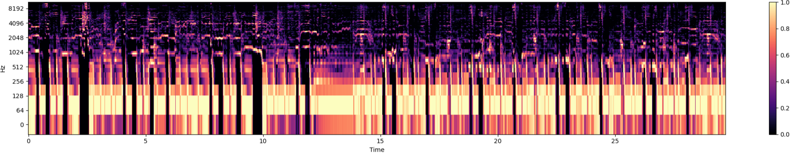
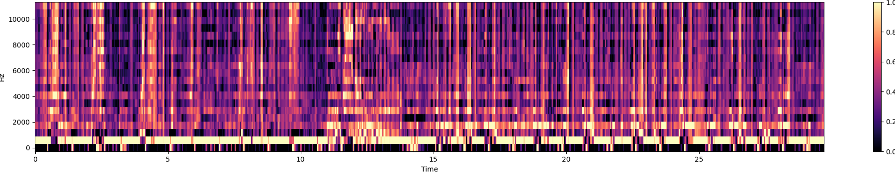
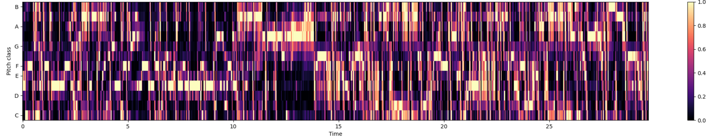

# music-sentiment-analysis

Music Sentiment Analyzer (MSA) predicts real-time sentiment of given music as VAD:
- **Valence**: the pleasantness of a stimulus
- **Arousal**: the intensity of emotion provoked by a stimulus
- **Dominance**: the degree of control exerted by a stimulus


## How to run

Codes of this repository were implemented on:
- windows 10
- python 3.11.5

First, install required packages with conda. 
```
conda env create -f environment.yaml
conda activate environment
```

You have to get [MuSe Dataset](https://www.kaggle.com/datasets/cakiki/muse-the-musical-sentiment-dataset) to generate your own dataset. 
You also have to log in Spotify API id and get CID and SECRET [here](https://developer.spotify.com).

Next, open [`user_values.py`](./user_values.py) and type path to your csv file, and Spotify API information. 
- `MUSE_CSV_PATH`: path to your MuSe csv file
- `SPOTIFY_CID`: Spotify API CID
- `SPOTIFY_SECRET`: Spotify API SECRET

Run [`generate_dataset.py`](./generate_dataset.py) to preprocess your own dataset. 
After running the command, you can see some npz files those compose a dataset. 
You can edit some parameters in editable zone if you can. 
```
python generate_dataset.py
```


## Dataset

I used [MuSe Dataset](https://www.kaggle.com/datasets/cakiki/muse-the-musical-sentiment-dataset) that contains sentiment information for 90,001 songs. 

It contains Spotify ID of songs, whose audios are available by using [Spotipy API](https://spotipy.readthedocs.io/en/2.22.1/?highlight=analysis#). However, there are some rows with no spotify id or no preview mp3, 34,951 songs are actually used for this project. 

After pre-processing the dataset, input and output of my model are:
- **input**
    - Mel-spectrogram
        
    - Mel-Frequency Cepstral Coefficients (MFCCs)
        
    - Chroma Frequencies
        
- **output**
    - VAD vector as (B, 3) `torch.Tensor`
        - `[[2.09, 6.18, 1.4]]` means the audio has high **Arousal**, while it has low **Valence** and **Dominance**. 
    - list of emotion tags as (B, num_tags) `torch.Tensor`. Each tag output is activated with `Sigmoid()`, so we can decide whether it matches the given audio or not. 
        - `[[1., 0., 1., 0.]]` for emotion tag dictionary `["reckless", "innocent", "confident", "serious]` means the audio tends to be reckless and confident, and not innocent and serious. 

Because dataset preprocessing task requires a lot of time, I implemented [`generate_dataset.py`](./generate_dataset.py) to save chunk of the full dataset. 
After running the code, there would be some npz files instead of one huge npz file. 
The npz files are combined to a full dataset during training. 

## Model

(TODO)
